# Assignment-4 EE321 Probability and Random Processes

This repository was made as an assignment for the FALL2020 course EE321. In this project we demonstrate the Image Denoising method using a non-local algorithm for the same - ["NL-means Algorithm"](https://www.iro.umontreal.ca/~mignotte/IFT6150/Articles/Buades-NonLocal.pdf)

## Table of contents

- [Problem Statement](#problem-statement)
- [Background](#background)
- [Dataset](#dataset)
- [Technologies](#technologies)
- [Mathmatical Aspects](#mathematical-aspects)
- [Setup](#setup)
- [Results](#results)
- [References](#references)

## Problem Statement

Several methods have been proposed to remove the noise and recover the true image from a noisy one. Even though they may be very different in tools it must be emphasized that a wide methodologies among them follow the same path of denoising the image by averaging the closeby pixels. For eg Gaussian Smoothing model, anisotropic filtering and the neigbourhood filtering are all local averaging algorithms that denoise the images by using neibourhood pixels.

The NL-means algorithm tries to follow a non-local approach as the name suggest, this not only helps get more information for the pixel to be solved but also reduces the smudging effect.

## Background

One of the fundamental challenges in the field of image processing and computer
vision is image denoising, where the underlying goal is to estimate the original
image by suppressing noise from a noise-contaminated version of the image. Image noise may be caused by different intrinsic (i.e., sensor) and extrinsic (i.e.,environment) conditions which are often not possible to avoid in practical situ-
ations. Therefore, image denoising plays an important role in a wide range of applications such as image restoration, visual tracking, image registration, im-
age segmentation, and image classification, where obtaining the original image content is crucial for strong performance. While many algorithms have been proposed for the purpose of image denoising, the problem of image noise suppression remains an open challenge, especially in situations where the images are acquired under poor conditions where the noise level is very high. We will be exploring non-local means algorithm for image denoising in this assignment.

## Dataset

We were provided with a dataset of [11 images](https://github.com/varunjain3/NLMeansDenoising/tree/main/Data). These images were converted into grayscale to be considered as the [ground truth images](https://github.com/varunjain3/NLMeansDenoising/tree/main/gt).

To denoise these images, we produce two type of synthetic noise and add them to the images to prepare the input images. We have used the [Guassian noised images](https://github.com/varunjain3/NLMeansDenoising/tree/main/gaussian) and the [Salt n Paper noised Images](https://github.com/varunjain3/NLMeansDenoising/tree/main/sp_noise).

## Technologies

The project uses Python >= 3.5

Other technologies used

- Jupyter Notebook
- OpenCV
- Pillow
- Matplotlib
- Numpy
- Tqdm

##### \* The project is also compatible with [Google Colabaratory](https://colab.research.google.com/)

## Mathematical Aspects

### Calculating weights for Non-Local Pixels

For every image, we define iterate for each (x) pixel. x determines the position of the pixel w.r.to the image. We also define R as operator which returns the pixel value of the (x).
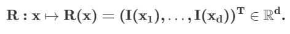

After defining the Pixel operator, we define distance between two pixels x and y as d(R(x),R(y)). This distance is the euciledian distance of pixel values of pixels at x and y.
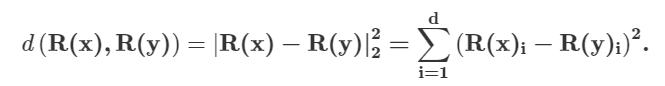

The similarity of two pixel locations are determined by their distance. Two pixel locations are considered similar if their distance is less. This distance is normalized using the exponential filtering.
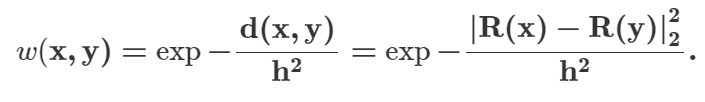

### Denoising using weights

We use the weights to obtaine an average over the centered area around x: where p is our search window:
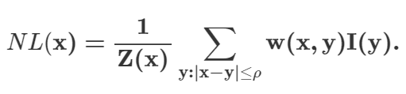

Here Z(x) is the sum of all the weights.

One can also interpret by looking at the given picture below.
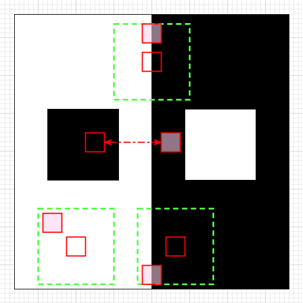

## Setup

This project tries to implement the algorithm given in the orignal paper.
The demo can be seen in the [following jupter notebook](https://github.com/varunjain3/NLMeansDenoising/blob/main/Assignment4_main.ipynb) and can be also opened in [Google Colaboratory](https://colab.research.google.com/github/varunjain3/NLMeansDenoising/blob/main/Assignment4_main.ipynb)

The cells can be executed in the Jupyter Notebooks after all the dependencies are installed.

## Results

### For Gaussian Noised Images -

Image1
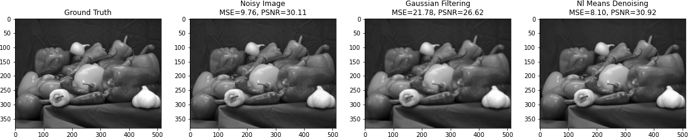
Image2
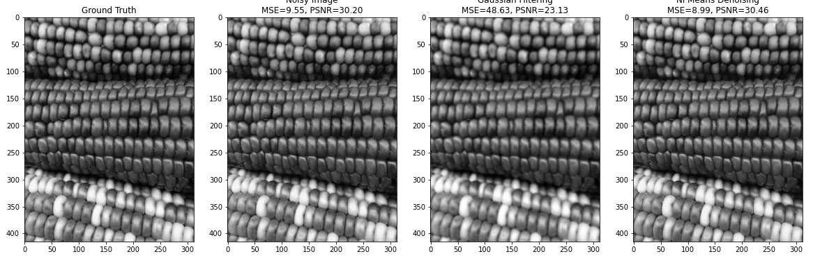
Image3
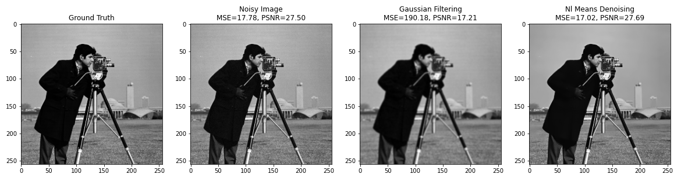
Image4
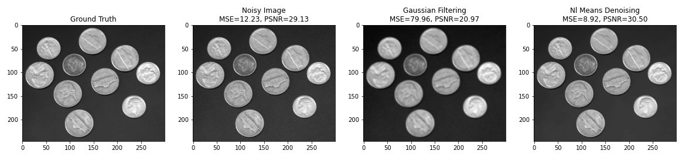
Image5
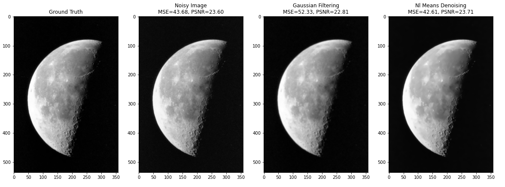
Image6
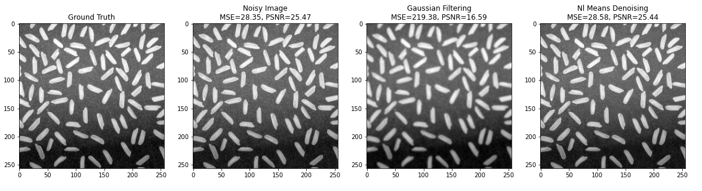
Image7
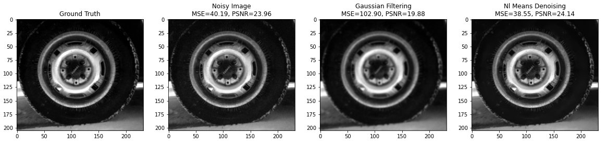
Image8
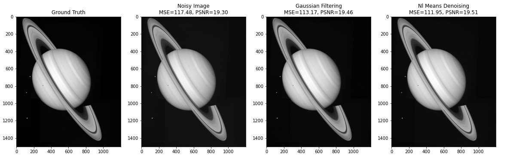
Image9
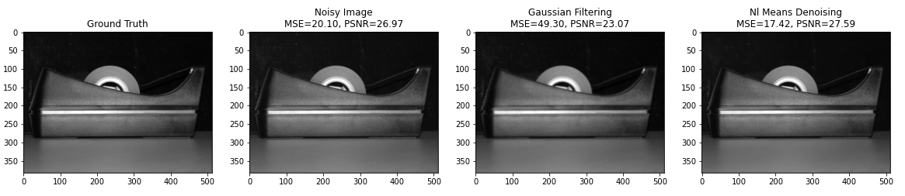
Image10
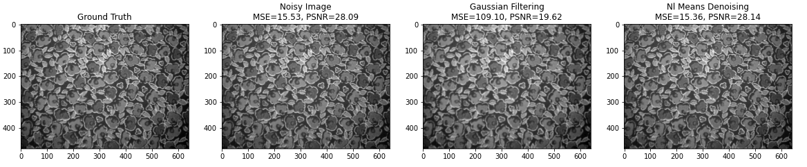

### For Salt n Pepper Noised Images -

Image1
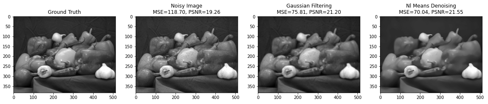
Image2
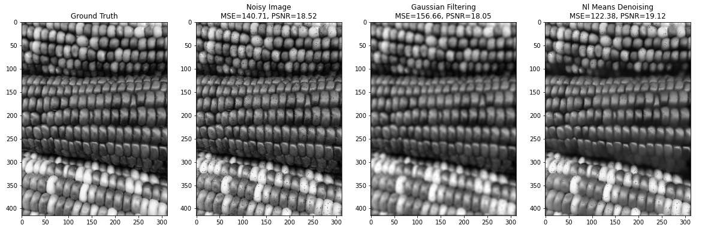
Image3
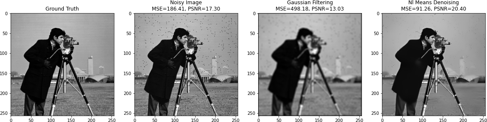
Image4
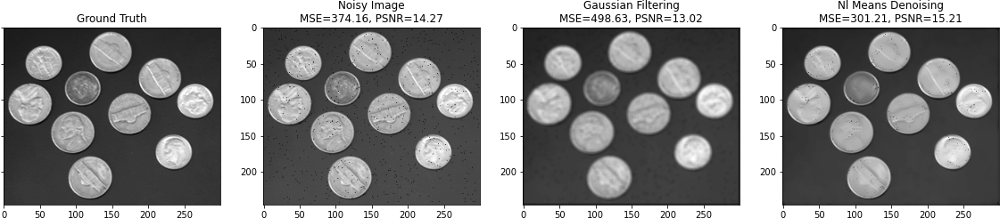
Image5
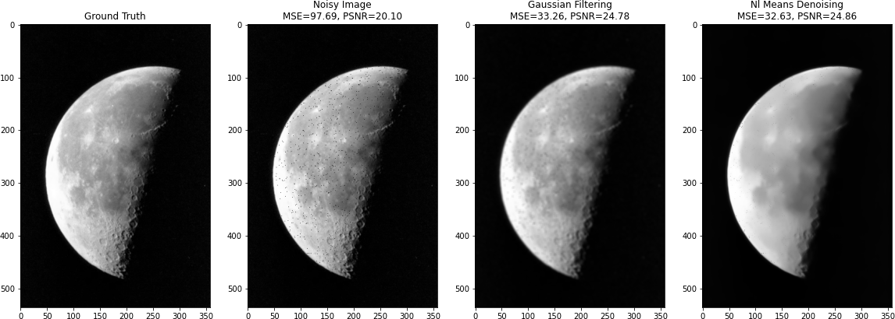
Image6
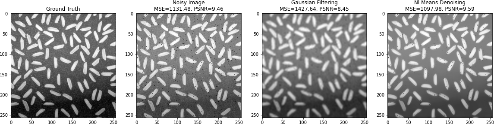
Image7
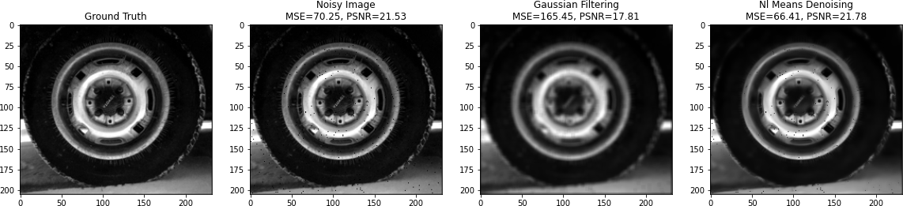
Image8
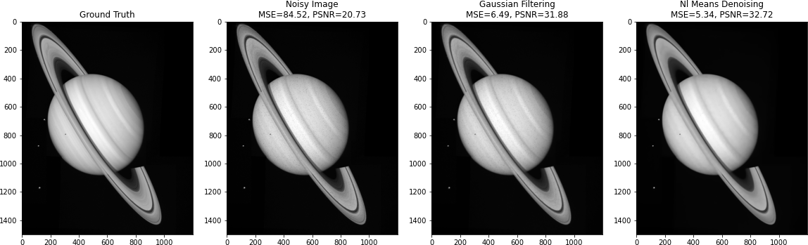
Image9
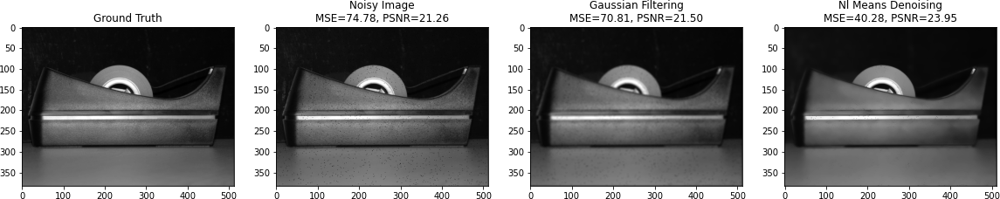
Image10
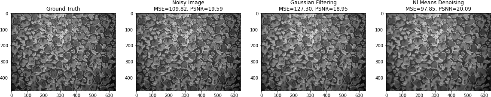

All the final images are stored in the [results](https://github.com/varunjain3/NLMeansDenoising/tree/main/Results) folder.

## References

[1] A. Buades, B. Coll and J. -. Morel, "A non-local algorithm for image denoising," 2005 IEEE Computer Society Conference on Computer Vision and Pattern Recognition (CVPR'05), San Diego, CA, USA, 2005, pp. 60-65 vol. 2, doi: 10.1109/CVPR.2005.38.

[2]Vincent Duval, Jean-François Aujol, Yann Gousseau. On the parameter choice for the Non-Local
Means. 2010. ffhal-00468856f

[3] Angelo, Emmanuel. "NL-Means: Some Math | Computers Don't See (Yet)". Computers Don't See (Yet), 2020, http://www.computersdontsee.net/post/2013-04-13-nl-means-some-math/. Accessed 17 Nov 2020.

[4] A repository to implement NL-means in Matlab [https://github.com/aminshabani/NL-Means](https://github.com/aminshabani/NL-Means)
